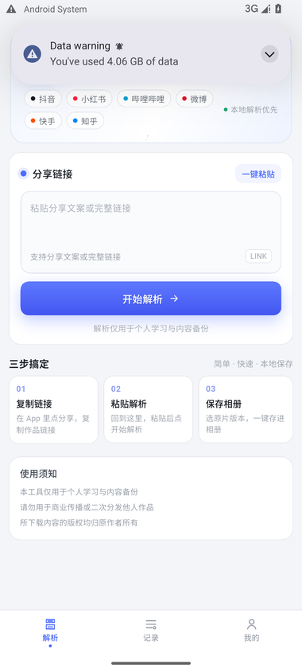
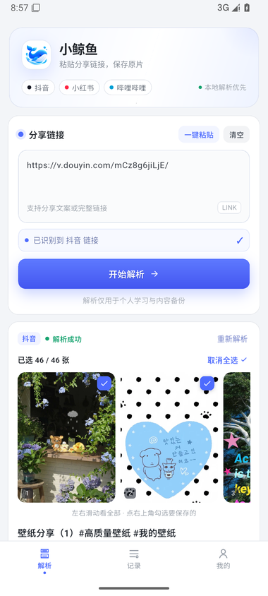

<div align="center">
  
  <h1>小鲸鱼</h1>
  <p><b>粘贴分享链接，保存无水印原片</b></p>
  <p>
    <sub>抖音 · 小红书 · 哔哩哔哩 · 微博 · 快手 · 知乎</sub><br>
    <sub>全程在手机本地解析 · 不上传链接 · 不需要服务器</sub>
  </p>
</div>

---

<div align="center">
  
  &nbsp;&nbsp;
  
  <br>
  <sub>左：首页，六个平台一键粘贴 &nbsp;|&nbsp; 右：图文作品解析后逐张勾选</sub>
</div>

---

## 下载安装

<div align="center">

### 👉 [**whale.kaogong.art/app**](https://whale.kaogong.art/app/)

<sub>国内服务器 · 直连 · 约 20 MB</sub>

</div>

> **为什么不从 GitHub 下载？**
> GitHub 在国内不翻墙基本下不动 —— 网页 `github.com` 时好时坏，
> 而 Release 附件走的 `objects.githubusercontent.com` **基本连不上**。
> 所以官网才是主渠道，本仓库的 [Releases](../../releases) 只作备用（海外用户 / 有代理时）。

---

## 它解决什么问题

抖音、小红书这些平台，直接在 App 里「保存到相册」拿到的是**带水印**的版本，
有的还会压缩画质。网上那些"去水印"工具又大多要你把链接发给**别人的服务器**。

小鲸鱼把解析**放回你自己的手机里**：

- 🚫 **不经过任何服务器** —— 链接没有任何地方可传，隐私上更放心
- 🎬 **无水印原片** —— 走各平台的原始资源，不是压缩过的展示版
- 📵 **不依赖网络服务** —— 没有后端要维护，服务器挂了也能用
- 🖼️ **图文可多选** —— 默认全选，也能只挑几张，或预览时单独存一张

---

## 支持平台

| 平台 | 视频 | 图文 | 实测耗时 | 怎么做到的 |
|:---:|:---:|:---:|:---:|---|
| **抖音** | ✅ | ✅ | ~12s | 视频走**手机分享页**取 `<video>` 直链；图文从 DOM 抠图 |
| **小红书** | ✅ | ✅ | ~3s | 抓页面解析内嵌数据；图片换公开 CDN 节点去水印 |
| **哔哩哔哩** | ✅ | — | ~3s | 公开 API + wbi 签名（纯 HTTP，最快） |
| **微博** | ✅ | ✅ | ~5s | 借内置 WebView 的 Cookie 调接口 |
| **快手** | ✅ | ✅ | ~6s | 手机分享页取 `<video>` 直链 |
| **知乎** | 专栏 | ✅ | ~8s | 专栏页 DOM 提取（**回答页需登录**，见下） |

> 耗时是在 Android 模拟器上实测的**冷启动**数据，第二次会更快。

### 关于水印：各平台的具体处理

| 平台 | 水印从哪来 | 怎么去掉 |
|---|---|---|
| 小红书 | 图片地址末尾的 `!h5_1080jpg` 处理模板 | 去掉模板 + 换到公开 CDN 节点（31 KB 带水印 → 62 KB 原图） |
| 抖音 | `playwm`（带水印）vs `play`（无水印） | 换路径**并换域名**（`m.douyin.com` 上没有 `play` 口子） |
| 微博 | 接口返回的 `large.url` 其实是 `/mw2000/` 压缩版 | 换成 `/large/`（1.2 MB → 2.4 MB） |
| B站 | **平台自带，无法去除** | — |

---

## 已知限制

**知乎回答页打不开**（`zhihu.com/question/…/answer/…`）
知乎要求登录才能看回答。请用**专栏文章**链接（`zhuanlan.zhihu.com/p/…`），
那个不需要登录。App 内遇到回答页会直接提示你怎么做。

**抖音图文偶尔失败一次**
这是抖音的风控 —— 短时间内解析太频繁时，它会悄悄返回一个「不渲染图片」的
降级页面（页面能打开、也不报错，就是没图）。App 会自动重试一次；
还不行的话，等十几秒再来。

**首次保存要授权相册**
Android 10 以上走 MediaStore，**不需要存储权限**；只会在第一次保存时
弹一次相册写入确认。

---

## 版本更新

App 内建自动检查，**不需要用户翻墙**：

```
主地址   https://whale.kaogong.art/app/version.json
备用地址 https://cdn.jsdelivr.net/gh/daniei-chen/Little-Whale@main/server/version.json
                    ↑ jsDelivr 转发 GitHub 上的同一份文件（国内实测可直连）
```

两个地址**任一可用**就能检查到更新，单一渠道挂掉不影响。

- 启动 3 秒后静默检查，只有真有新版才弹窗
- 同一个版本 **24 小时内只提醒一次**
- 网络失败**静默跳过** —— 更新检查永远不打扰用户
- 点「立即更新」跳官网下载页，覆盖安装**数据都保留**

### 发版

```powershell
.\tools\release.ps1 -Notes "新增 XX 平台"
```

自动完成：版本号三处同步（`pubspec.yaml` / `lib/config.dart` / `server/version.json`）
→ 跑 `flutter analyze` + 单元测试（不过就拒绝发版）→ 构建 APK → 提交推送。

推完再手动做两步：传 APK 到服务器、同步 `version.json`。

---

## 技术实现

核心是**在 App 里内置一个隐藏的 WebView**，让平台自己的 JS 正常跑，
我们只在旁边拦截它发出的请求 —— 服务端方案是同一套思路，只是把浏览器
从服务器搬进了手机。

```
┌─ App ────────────────────────────────────────────────┐
│                                                      │
│  普通平台 ──► dio 直连公开 API ──► 拿到媒体直链       │
│  (B站/小红书)                                         │
│                                                      │
│  难缠平台 ──► 隐藏 WebView ──► 执行页面 JS            │
│  (抖音/快手/微博/知乎)   │                            │
│                          ├─ 注入钩子拦截 fetch / XHR  │
│                          ├─ 特征伪装（补桌面 Chrome 特征）│
│                          └─ 读 DOM / 页面变量          │
│                                                      │
│  下载 ──► 直连 CDN（带 Referer 过防盗链）              │
│          断点续传 · 按文件头判定扩展名                  │
└──────────────────────────────────────────────────────┘
                    ↓
              保存到系统相册
```

### 加一个平台要做什么

1. 在 `lib/local/` 实现一个 `LocalPlatform` 子类
   （`key` / `name` / `hosts` / `referer` / `parse`）
2. 在 `lib/local/registry.dart` 的 `all` 列表加一行
3. 在 `lib/data/platforms.dart` 的 `kPlatforms` 加一行（**界面上的平台标签**）

> 第 3 步最容易漏 —— 漏了的话解析其实已经支持，但用户界面上看不到，
> 会以为没做。所以有一条单元测试专门断言这两个列表一一对应。

---

## 自行构建

```bash
# 环境：Flutter 3.35+ / JDK 17 / Android SDK 35
git clone https://github.com/daniei-chen/Little-Whale.git
cd Little-Whale
flutter pub get

flutter analyze                        # 应当零问题
flutter test                           # 单元测试
flutter build apk --release --split-per-abi
```

集成测试要连着真机或模拟器：

```bash
flutter test integration_test/local_parse_test.dart -d <设备ID>
```

<details>
<summary><b>项目结构</b>（点开）</summary>

```
lib/
├── config.dart                版本号、更新清单地址
├── local/                     ★ 本地解析引擎
│   ├── engine.dart            隐藏 WebView：注入钩子、拦截响应、特征伪装
│   ├── registry.dart          平台注册表
│   ├── types.dart             统一结果模型
│   ├── douyin.dart            抖音
│   ├── xiaohongshu.dart       小红书
│   ├── bilibili.dart          B站
│   ├── weibo.dart             微博
│   ├── kuaishou.dart          快手
│   └── zhihu.dart             知乎
├── services/
│   ├── download_service.dart  下载：断点续传、按文件头定后缀
│   └── update_service.dart    检查更新
├── pages/                     首页 / 记录 / 我的
├── widgets/                   通用组件
└── state/app_state.dart       全局状态

server/version.json            更新清单（备用副本）
tools/release.ps1              一键发版
docs/                          README 用的图标与截图
```

</details>

---

## 免责声明

本工具仅供**个人学习与内容备份**使用。

请勿用于商业传播或二次分发他人作品。下载内容的版权均归原作者所有，
请尊重创作者。
